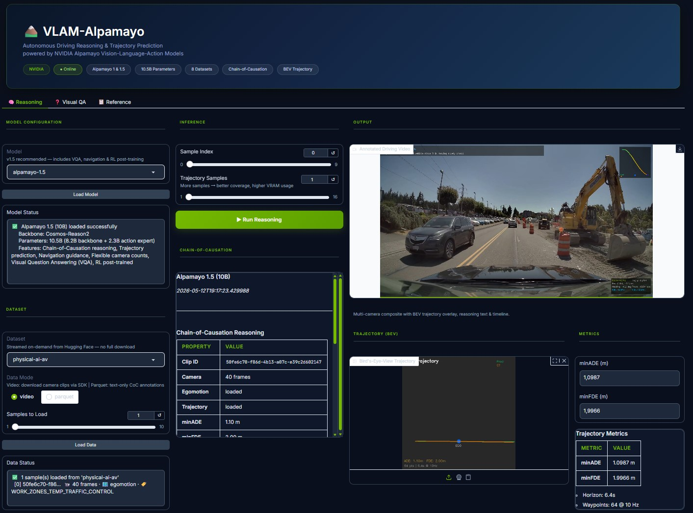
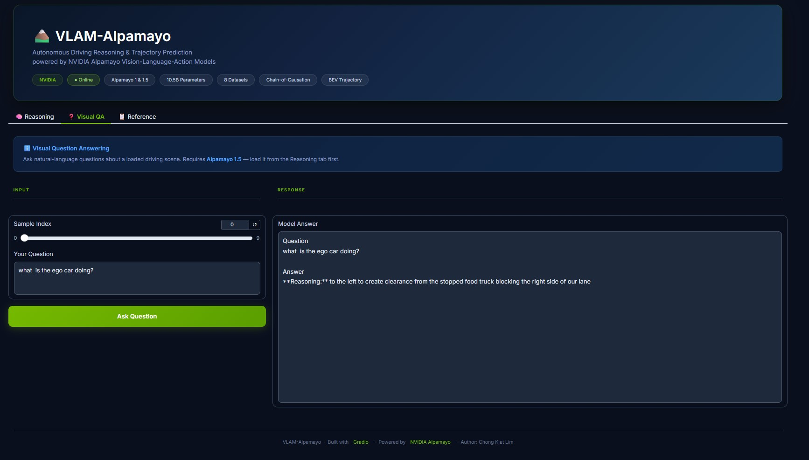

# 🏔️ VLAM-Alpamayo

**Author:** Chong Kiat Lim

An application for autonomous driving reasoning and explanation using NVIDIA's Alpamayo Vision-Language-Action (VLA) models. Provides both a **CLI** and a **web GUI** (Gradio) to run Chain-of-Causation reasoning and trajectory prediction on driving scenes.

## Supported Models

| Model | Key | Description |
|---|---|---|
| [Alpamayo 1 (R1-10B)](https://huggingface.co/nvidia/Alpamayo-R1-10B) | `alpamayo-1` | Core CoC reasoning + trajectory prediction |
| [Alpamayo 1.5 (10B)](https://huggingface.co/nvidia/Alpamayo-1.5-10B) | `alpamayo-1.5` | Adds navigation guidance, flexible cameras, VQA, RL post-training **(recommended)** |

For a detailed comparison, see [docs/models.md](docs/models.md).

## Dataset

This project supports **8 driving datasets** streamed on-demand from Hugging Face (no full download required), including NVIDIA's [PhysicalAI-Autonomous-Vehicles](https://huggingface.co/datasets/nvidia/PhysicalAI-Autonomous-Vehicles) (1,700 hours, 306K clips, 25 countries), plus LingoQA, nuScenesQA, CODA-LM, DriveGPT4, OmniDrive, and more. See [docs/datasets.md](docs/datasets.md) for the full list.

---

## Prerequisites

### Hardware

- **GPU:** NVIDIA GPU with **≥ 24 GB VRAM** (e.g., RTX 3090, RTX 4090, A5000, H100)
- Multi-sample inference (16 samples) requires ~40 GB; with CFG ~60 GB

### Software

| Requirement | Version |
|---|---|
| **OS** | Linux (recommended; tested). Windows/WSL2 may work but is unverified. |
| **Python** | 3.12.x |
| **PyTorch** | ≥ 2.8 with CUDA support |
| **CUDA Toolkit** | 12.x (for Flash Attention 2; optional if using SDPA fallback) |
| **Transformers** | ≥ 4.57.1 |
| **DeepSpeed** | ≥ 0.17.4 |
| **ffmpeg** | System package — **required** for browser-playable video output |

### Hugging Face Access

You **must** request access to these gated resources before using them (accept the license on each page):

**Backbone models (gated):**

1. [nvidia/Cosmos-Reason2-8B](https://huggingface.co/nvidia/Cosmos-Reason2-8B) (backbone for Alpamayo 1.5)
2. [nvidia/Cosmos-Reason-8B](https://huggingface.co/nvidia/Cosmos-Reason-8B) (backbone for Alpamayo 1)

**Datasets (gated):**

3. [nvidia/PhysicalAI-Autonomous-Vehicles](https://huggingface.co/datasets/nvidia/PhysicalAI-Autonomous-Vehicles) (primary dataset)
4. [nvidia/PhysicalAI-Autonomous-Vehicles-NuRec](https://huggingface.co/datasets/nvidia/PhysicalAI-Autonomous-Vehicles-NuRec) (neural-reconstructed scenes)

The Alpamayo model weights are openly available (no access request needed):

- [nvidia/Alpamayo-R1-10B](https://huggingface.co/nvidia/Alpamayo-R1-10B) (Alpamayo 1)
- [nvidia/Alpamayo-1.5-10B](https://huggingface.co/nvidia/Alpamayo-1.5-10B) (Alpamayo 1.5)

Get your token at: https://huggingface.co/settings/tokens

---

## Installation

### 1. Clone the repository

```bash
git clone <your-repo-url>
cd vlam-alpamayo
```

### 2. Create and activate a virtual environment

```bash
python -m venv .alpamayo_venv

# Linux/macOS
source .alpamayo_venv/bin/activate

# Windows
.\.alpamayo_venv\Scripts\activate
```

### 3. Install dependencies

```bash
pip install -r requirements.txt
```

### 3b. Install ffmpeg (for video playback)

The GUI and CLI generate annotated MP4 videos. Browsers require H.264 encoding,
which needs ffmpeg installed at the system level:

```bash
# Ubuntu / Debian
sudo apt update && sudo apt install -y ffmpeg

# macOS
brew install ffmpeg

# Conda (any OS)
conda install -c conda-forge ffmpeg
```

Verify: `ffmpeg -version`. Without ffmpeg, videos will be saved with the mp4v
codec which most browsers cannot play (you'll see "NaN:NaN" in the player).

### 4. Install Flash Attention 2 and Alpamayo models

These must be installed **after** the core dependencies:

```bash
# Flash Attention 2 (requires CUDA Toolkit with nvcc on PATH)
pip install flash-attn --no-build-isolation

# Alpamayo model packages (--no-deps avoids pulling non-PyPI transitive deps)
pip install --no-deps git+https://github.com/NVlabs/alpamayo.git
pip install --no-deps git+https://github.com/NVlabs/alpamayo1.5.git
```

> **Note:** If `flash-attn` fails to build, the app falls back to PyTorch's SDPA attention (the default in `config/.env.sample`).

### 5. Authenticate with Hugging Face

Log in to download model weights and access gated datasets:

```bash
hf auth login
```

Paste your token from https://huggingface.co/settings/tokens ("Read" scope is sufficient).

### 6. Download model weights

The model weights (~22 GB each) are cached locally after the first download:

```bash
# Alpamayo 1.5 (recommended)
python -c "from huggingface_hub import snapshot_download; snapshot_download('nvidia/Alpamayo-1.5-10B')"

# Alpamayo 1 (optional)
python -c "from huggingface_hub import snapshot_download; snapshot_download('nvidia/Alpamayo-R1-10B')"
```

> **Tip:** On a 100 MB/s connection, expect ~3–4 minutes per model. Subsequent runs use the cache.

### 7. Configure the application

Copy the sample config and set your token:

```bash
cp config/.env.sample config/.env
```

Then edit `config/.env`:

```
HUGGINGFACE_API_TOKEN=hf_your_token_here
```

> **Note:** `config/.env` is git-ignored. Only `config/.env.sample` (with placeholder values) is tracked.

Alternatively, set it as an environment variable:

```bash
export HUGGINGFACE_API_TOKEN=hf_your_token_here
# or
export HF_TOKEN=hf_your_token_here
```

---

## Quick Start

### CLI — Show info

```bash
python -m src.cli info
```

### CLI — Run reasoning inference

```bash
# Use the default model (Alpamayo 1.5)
python -m src.cli run

# Use Alpamayo 1 with 3 samples from a specific dataset
python -m src.cli run --model alpamayo-1 --num-data 3 --dataset drivelm

# Save JSON to a specific file (video is always saved to output/)
python -m src.cli run --output results/my_result.json
```

Each run generates a **JSON result file** and an **annotated MP4 video** (with camera frames, BEV trajectory overlay, reasoning text, and timeline) in `output/`.

### CLI — Visual Question Answering (Alpamayo 1.5 only)

```bash
python -m src.cli vqa "What is the ego vehicle doing?"
python -m src.cli vqa "Is it safe to change lanes?" --dataset lingoqa
```

### GUI — Launch the web interface

```bash
python -m src.cli gui
```

Then open http://127.0.0.1:7860 in your browser.

```bash
# Share publicly via Gradio
python -m src.cli gui --share
```

For full usage details, see [docs/usage.md](docs/usage.md).

---

## GUI Features

The Gradio web interface provides a single-page layout with:

### Output Panel

- **Annotated Video** — Multi-camera composite with:
  - BEV mini-map (top-right) with Pred/GT legend
  - CoC reasoning log (top-left, streaming with timestamps)
  - Per-frame trajectory info + streaming ADE/FDE (bottom-right)
  - **Speed & steering angle** (bottom-right, yellow — *derived from trajectory*)
  - Timeline progress bar
- **Trajectory (BEV)** — Zoomable, full-screen capable Bird's-Eye-View plot showing predicted vs GT trajectories with ADE/FDE text
- **Metrics** — minADE, minFDE, plus derived speed and steering statistics

### Screenshots

**Reasoning Tab:**



**Visual QA Tab:**



**Sample Output Video:**

See [docs/images/sample_output.mp4](docs/images/sample_output.mp4) for a full annotated video with trajectory overlay, CoC reasoning, and streaming metrics.

### Derived Metrics: Speed & Steering Angle

The model predicts future trajectory waypoints (64 points at 10 Hz over 6.4 s). Speed and steering angle are **not direct model outputs** — they are **computed from the predicted trajectory**:

| Metric | Formula | Description |
|--------|---------|-------------|
| **Speed** | $v = \\|\\Delta p\\| / \\Delta t$ | Displacement between consecutive waypoints divided by timestep (0.1 s) |
| **Steering** | $\\delta = \\theta_t - \\theta_{t-1}$ | Change in heading angle ($\\text{atan2}(\\Delta y, \\Delta x)$) between consecutive steps |

On the video overlay, these appear in **yellow** with an asterisk (`*`) and a footnote "derived from trajectory" to clearly distinguish them from direct model predictions.

### Key Parameters

| Parameter | Description |
|---|---|
| **Samples to Load** | Number of **driving scenes/clips** to download from the dataset. Each is a distinct driving scenario (different timestamp, road, situation). Use "Sample Index" to select which one to run inference on. |
| **Trajectory Samples** | Number of **predicted future trajectories** the model generates per scene. The model stochastically samples multiple possible driving paths — more samples give better coverage of possible behaviors and a more robust minADE/minFDE (best-of-N metric), but require more VRAM. E.g., 8 trajectory samples → 8 predicted paths drawn on the BEV plot. |
| **Sample Index** | Which loaded data sample (scene) to run inference on (0-indexed). |

### Tabs

1. **Reasoning** — Main inference tab with data loading, model controls, video output, trajectory plot, and metrics
2. **Visual QA** — Ask natural-language questions about a loaded driving scene (Alpamayo 1.5 only)
3. **Reference** — Model comparison table and supported dataset list

---

## Project Structure

```
vlam-alpamayo/
├── config/
│   ├── .env.sample           # Configuration template (tracked in git)
│   └── .env                  # Your local config (git-ignored)
├── docs/
│   ├── models.md             # Model comparison & technical details
│   ├── datasets.md           # Dataset documentation
│   └── usage.md              # Detailed usage guide
├── src/
│   ├── __init__.py
│   ├── cli.py                # CLI application
│   ├── gui.py                # Gradio web GUI
│   ├── config.py             # Configuration loader
│   ├── model_loader.py       # Model loading & authentication
│   ├── data_loader.py        # Dataset loading (14 datasets)
│   ├── inference.py          # Inference engine
│   └── visualization.py      # Video & trajectory rendering
├── output/                   # Generated results (git-ignored)
├── .gitignore
├── requirements.txt
└── README.md
```

---

## Configuration

Copy `config/.env.sample` to `config/.env` and edit. Environment variables override file values.

| Variable | Default | Description |
|---|---|---|
| `HUGGINGFACE_API_TOKEN` | *(required)* | Hugging Face access token |
| `DEFAULT_MODEL` | `alpamayo-1.5` | Default model (`alpamayo-1` or `alpamayo-1.5`) |
| `DEVICE` | `cuda` | PyTorch device |
| `DTYPE` | `bfloat16` | Model precision |
| `ATTN_IMPLEMENTATION` | `eager` | `flash_attention_2` or `eager` |
| `NUM_TRAJ_SAMPLES` | `1` | Trajectory samples per inference |
| `OUTPUT_DIR` | `output` | Result output directory |
| `GUI_HOST` | `127.0.0.1` | GUI server host |
| `GUI_PORT` | `7860` | GUI server port |

---

## Troubleshooting

### Video shows "NaN:NaN" or won't play in the browser

**ffmpeg is not installed.** The video was saved with the mp4v codec which browsers can't play.
Install ffmpeg (see step 3b above) and re-run. The app will automatically encode to H.264.

### CUDA out-of-memory

- Ensure your GPU has ≥ 24 GB VRAM
- Reduce `NUM_TRAJ_SAMPLES` in your `config/.env`
- Close other GPU-intensive applications

### Flash Attention build errors

If `flash-attn` fails to install, use SDPA instead (the default in `config/.env.sample`):

```
ATTN_IMPLEMENTATION=sdpa
```

### Model download is slow

The model weights are ~22 GB. On a 100 MB/s connection, expect ~2.5 minutes. Weights are cached after the first download.

---

## License

- **This application:** MIT
- **Alpamayo model weights:** [Non-commercial license](https://huggingface.co/nvidia/Alpamayo-R1-10B/blob/main/LICENSE) (commercial licensing available from NVIDIA)
- **Alpamayo inference code:** Apache License 2.0
- **PhysicalAI-AV dataset:** [NVIDIA AV Dataset License](https://huggingface.co/datasets/nvidia/PhysicalAI-Autonomous-Vehicles/blob/main/LICENSE.pdf)

## References

- [Alpamayo-R1 Paper (arXiv:2511.00088)](https://arxiv.org/abs/2511.00088)
- [NVIDIA Alpamayo at CES 2026](https://nvidianews.nvidia.com/news/alpamayo-autonomous-vehicle-development)
- [Alpamayo 1 Code](https://github.com/NVlabs/alpamayo)
- [Alpamayo 1.5 Code](https://github.com/NVlabs/alpamayo1.5)
- [AlpaSim Simulator](https://github.com/NVlabs/alpasim)

---

## Tech Stack

| Technology | Description |
|---|---|
| **Python 3.12** | Core language for the application |
| **PyTorch ≥ 2.8** | Deep learning framework for model inference and tensor operations |
| **Hugging Face Transformers** | Model loading, tokenization, and inference pipeline for 10B-parameter VLA models |
| **Hugging Face Hub / Datasets** | Streaming access to gated model weights and 8 driving datasets without full download |
| **NVIDIA Alpamayo (VLA)** | Vision-Language-Action models combining perception, Chain-of-Causation reasoning, and diffusion-based trajectory prediction |
| **DeepSpeed** | Distributed inference optimization for large-scale model loading |
| **Flash Attention 2 / SDPA** | Memory-efficient attention implementations for running 10B models on consumer GPUs (24 GB+) |
| **Gradio** | Interactive web GUI with video playback, image display, dropdowns, sliders, and tabbed layout |
| **OpenCV (cv2)** | Video encoding (MP4), frame compositing, BEV trajectory overlay, and text rendering |
| **NumPy** | Numerical operations for trajectory processing, coordinate transforms, and visualization |
| **argparse** | CLI framework with subcommands (`run`, `vqa`, `gui`, `info`), dataset/model selection |
| **python-dotenv** | Configuration management via `config/.env` (from `.env.sample` template) with environment variable overrides |
| **ffmpeg** | Optional H.264 re-encoding for browser-compatible video playback — **required** for video display in the GUI |
| **Git / GitHub** | Version control and collaborative development |
